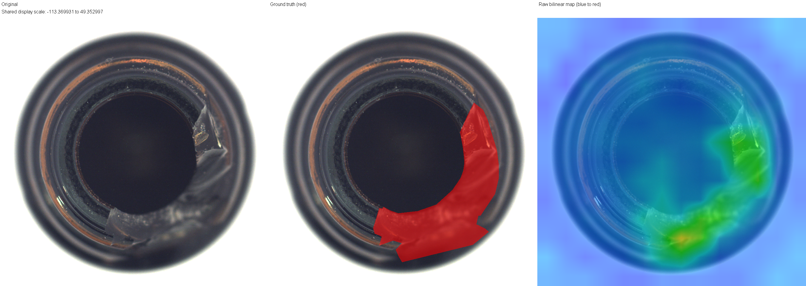

# Anomalib4j

**Anomaly detection industriale in Java: inferenza ONNX su CPU, memoria visuale locale e scoring VSA compilato.**

[English version](README.en.md)

Anomalib4j è un progetto di computer vision in **Java 21 e ONNX Runtime**, con **MobileNetV4**, per individuare anomalie nelle immagini e localizzarle attraverso heatmap.

Il progetto affronta due aspetti principali: ridurre il costo del confronto con una memoria visuale e descrivere meglio la variabilità degli esempi normali. La baseline Java compila lo scoring VSA in filtri equivalenti sulle feature CNN; il successivo modello M2 migliora la localizzazione apprendendo la dispersione locale. Codice, test e misure documentano entrambi i risultati.

## Risultati principali

- **Pipeline Java su CPU:** preprocessing, estrazione delle feature ONNX, scoring locale e produzione delle heatmap.
- **M2, miglior detector attuale:** nella localizzazione raggiunge AUPRO **0.916 su Bottle** e **0.624 su Metal Nut**, rispetto a **0.877** e **0.380** di M0.
- **Equivalenza Adjoint verificata:** errore massimo **1.31 × 10⁻¹²** fra score VSA esplicito e compilato, su **16.268 patch** reali.
- **Prestazioni M0:** circa **12 µs per 196 posizioni** nel kernel JMH; su Bottle, **3.723 ms p50** per detection e **9.486 ms p50** per localizzazione completa.
- **Benchmark sullo stesso hardware:** confronto della v1 con PaDiM e PatchCore, qualità valutata con convenzioni comuni e costi di esecuzione documentati.

**Le metriche M2 e le latenze M0 appartengono a versioni diverse del detector.**

## Il progetto in breve

L’ingresso è un’immagine RGB. MobileNetV4, preaddestrata e congelata, estrae una griglia **14×14×96**: 196 descrittori locali da 96 componenti. La memoria apprende il comportamento nominale da immagini normali.

Per ogni posizione il detector calcola uno scostamento; una calibrazione usa normali separati dal fitting. Il massimo della mappa calibrata fornisce lo score immagine; l’interpolazione produce la heatmap alla risoluzione originale.

```text
Immagine RGB
    |
Preprocessing + MobileNetV4 / ONNX
    |
Feature 14×14×96 --> descrittori normalizzati
    |
Memoria locale + scoring per posizione
    |
Calibrazione posizionale
    +--> score immagine
    `--> mappa 14×14 --> heatmap a piena risoluzione
```

Il core della baseline M0 è Java. Gli strumenti di confronto e l’ablazione M2 includono Python; M2 lavora sulle stesse feature estratte dall’encoder Java.



*Output della baseline M0/v1, variante RAW di localizzazione: immagine, annotazione del difetto e overlay. Non è un output M2. I colori rappresentano uno score su scala di visualizzazione, non probabilità.*

## Miglior detector attuale

**M2 è il miglior detector attuale del progetto per la localizzazione nelle due categorie valutate.**

Per ogni posizione apprende il comportamento medio delle feature e la normale variabilità di ogni componente. Una deviazione in una componente stabile conta quindi più della stessa deviazione in una componente naturalmente variabile. Lo score combina i residui standardizzati al quadrato.

Risultati dopo calibrazione posizionale Z; valori maggiori sono migliori:

| Categoria | Modello | Image AUROC | Pixel AUROC | AUPRO@0.30 |
|---|---|---:|---:|---:|
| Bottle | M0 — baseline v1 | 1.000000 | 0.961664 | 0.877447 |
| Bottle | **M2 — dispersione locale** | **1.000000** | **0.975697** | **0.915738** |
| Metal Nut | M0 — baseline v1 | 0.757576 | 0.692630 | 0.379794 |
| Metal Nut | **M2 — dispersione locale** | **0.845552** | **0.849318** | **0.624208** |

Image AUROC misura la separazione fra immagini normali e anomale; Pixel AUROC misura la separazione a livello di pixel; AUPRO valuta la copertura delle regioni difettose, considerando false-positive rate fino a 0.30.

**M2 è stato sviluppato dopo il benchmark congelato della v1**, mantenendo feature CNN e split. Il confronto esterno con PaDiM/PatchCore riguarda quindi M0.

## Compilazione dello scoring VSA

M0 costruisce una memoria nello spazio VSA, una rappresentazione a **10.000 dimensioni**, accumulando statistiche ed esempi nominali in archetipi posizionali.

Una volta fissata la memoria, proiezione, standardizzazione e confronto con l’archetipo possono essere incorporati in un filtro sulle **96 feature CNN**. Questa trasformazione è la compilazione Adjoint.

La proiezione ad alta dimensionalità scompare dall’inferenza, conservando lo score. La normalizzazione delle feature resta nel percorso. La verifica sulle 83 immagini Bottle ha confrontato **16.268 celle**, con errore assoluto massimo **1.31 × 10⁻¹²**.

La successiva misura JMH del kernel è circa **12 µs per mappa**. È il costo dello scoring: estrazione CNN e costruzione della heatmap appartengono alla latenza completa.

## Benchmark congelato della baseline Java v1

**Precedente all’introduzione di M2.** Le tabelle conservano i sistemi effettivamente eseguiti nel run originale, senza sostituirli con risultati successivi.

Confronto con le implementazioni **Anomalib 2.6.2** di PaDiM e PatchCore, su **AMD Ryzen AI 9 HX 370**, Windows 11:

| Categoria | Metodo | Image AUROC | Pixel AUROC | AUPRO@0.30 |
|---|---|---:|---:|---:|
| Bottle | **Anomalib4j M0** | **1.000** | **0.962** | **0.877** |
| Bottle | PaDiM | 0.998 | 0.978 | 0.922 |
| Bottle | PatchCore | 1.000 | 0.985 | 0.944 |
| Metal Nut | **Anomalib4j M0** | **0.758** | **0.693** | **0.380** |
| Metal Nut | PaDiM | 0.952 | 0.941 | 0.851 |
| Metal Nut | PatchCore | 0.998 | 0.987 | 0.940 |

Latenza mediana per localizzazione alla risoluzione originale:

| Categoria | Risoluzione | M0 | PaDiM | PatchCore |
|---|---|---:|---:|---:|
| Bottle | 900×900 | **9.49 ms** | 57.60 ms | 247.42 ms |
| Metal Nut | 700×700 | **5.78 ms** | 44.46 ms | 222.93 ms |

La sola detection M0 misura **3.723 ms** su Bottle e **3.695 ms** su Metal Nut. Le misure includono preprocessing e inferenza, batch 1, immagine già decodificata; escludono caricamento file e costruzione del modello.

Backbone e budget di fitting differiscono fra sistemi. Le latenze usano JMH per Java e un harness Python per i competitor. Il risultato misura un compromesso qualità/costo dell’intera pipeline; non attribuisce il vantaggio al solo Adjoint.

## Dal limite al miglioramento

La localizzazione debole di M0 su Metal Nut ha portato a esaminare memoria e statistiche. L’archetipo descrive una direzione posizionale relativa alla popolazione globale, senza modellare esplicitamente la dispersione nominale locale.

M2 introduce quella dispersione mantenendo le feature congelate. Il confronto verifica un miglioramento su entrambe le categorie, particolarmente su Metal Nut: **misurazione del limite, diagnosi, modifica mirata e verifica**.

## Cosa dimostra questo progetto

- **Integrazione AI in Java:** ONNX Runtime, preprocessing e gestione dei descrittori.
- **Progettazione e ottimizzazione:** memoria posizionale e compilazione dello scoring.
- **Verifica e benchmarking:** test numerici, JMH e confronto fra sistemi.
- **Diagnosi misurabile:** modifica del modello di memoria, confronto sulle stesse feature e risultati documentati.

## Avvio e approfondimenti

Prerequisiti del core: **JDK 21 e Maven**. I test usano JUnit 5. Per compilare ed eseguire un gruppo mirato di test algebrici e di memoria, senza training su immagini reali:

```shell
mvn -B "-Dtest=AdjointEquivalenceTest,DenseRademacherProjectionTest,ProjectionStatisticsAccumulatorTest,PositionalMemoryBuilderTest" test
```

Il normale `mvn test` comprende anche test su dati reali. Dataset e artefatti del benchmark sono esterni alla copia pubblica; i prerequisiti della riproduzione completa sono nella panoramica tecnica.

- [Panoramica tecnica](docs/TECHNICAL_OVERVIEW.md): flusso dei dati, modelli, formule e riproducibilità.
- [Equivalenza su immagini reali](docs/development/SPRINT7_RESULT.md).
- [Benchmark completo](docs/benchmark/BENCHMARK_FINAL_RESULT.md).
- [Ablazione della memoria locale](docs/diagnostics/LOCAL_MEMORY_ABLATION_RESULT.md).
- [Diagnostica posizionale/globale](docs/diagnostics/POSITIONAL_GLOBAL_VARIANCE_DIAGNOSTIC.md).

## Stato e limiti

Il progetto è un prototipo, non un prodotto pronto per la produzione. I risultati riguardano due categorie MVTec AD con backbone congelato; l’ablazione interna usa categorie già osservate e non dimostra generalizzazione indipendente. M2 non è incluso nel run esterno PaDiM/PatchCore e i risultati non attestano superiorità generale.
